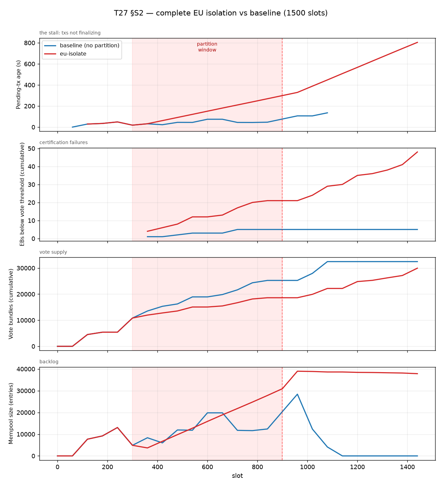

# T27 §S2 — Complete EU isolation (true bipartition)

A **complete** network partition: the EU node set severed from *all* other
nodes, with no bridge population to relay across the cut. Contrast the earlier
`EU↔NA` run, which only cut EU-to-NA edges and left ~712 other-region nodes
bridging the two sides — so it barely registered (0.3% vote dip).



## Setup

| | |
|---|---|
| Topology | `topology-v4-mainnet.yaml` (2685 nodes, 30,414 connections, 1 Gbps/link) |
| Params | `sim-cli/configs/mainnet.yaml` (`linear-with-tx-references`, sequential, 6 shards) |
| Overlay | `eu-isolate.yaml` — `kind: isolate`, EU (1052) vs 1633 others, `direction: both` |
| Offered load | ~133 tx/s, 1500 B/tx, active slots 60–960 |
| Partition window | **slots 299–899**, **84,746 edges cut** |
| Slots | 1500 (both baseline and partitioned — length-matched) |

Overlay generated with the `--isolate` mode (cuts the group off from everyone,
not just from a named other group):

```sh
python3 scripts/gen-partition.py \
    ../data/simulation/pseudo-mainnet/topology-v4-mainnet.yaml \
    --from EU --isolate --name eu-isolate --start 300 --stop 900 -o eu-isolate.yaml
```

The cut count proves a true bipartition — **84,746 edges** vs the leaky EU↔NA's
53,744 (the extra ~31k are EU↔others links the bridge version left intact):

```
INFO sim_cli::events: Network partition 'eu-isolate' activated: 84746 edge(s) cut.
INFO sim_cli::events: Network partition 'eu-isolate' healed:    84746 edge(s) restored.
```

## Headline: the partition does NOT recover after heal

This is the key result, and it was a surprise. The cut heals at slot 899, tx
generation stops at 960, yet the partitioned chain keeps degrading through to
slot 1499 — it never catches up:

| metric | baseline (`full`) | EU-isolated |
|---|---|---|
| txs finalized | **120,006 / 120,006** | **33,866 / 120,006** |
| EBs below vote threshold | 5 / 41 | **52 / 64** |
| L1 blocks with a Leios endorsement | 19 | **7** |
| mempool by end of run | drains to **0** (by ~slot 1140) | pinned at **~38,000** |
| pending-tx age, last report | — (drained) | **804 s and still climbing** |

The figure shows it cleanly: every red curve keeps diverging from blue *past*
the dashed heal line at slot 899.

- **Pending-tx age** ramps ~linearly the entire run (≈ time since the cut) and
  does not turn over after heal — txs from the partition era are still stuck.
- **EBs below quorum** keeps climbing 21 → 48 *after* heal: EBs produced post-heal
  also fail to certify.
- **Mempool** stays pinned at ~38k while the baseline drains to zero.

### A/B time series (`analyze.py --ab full eu-isolate`)

```
 slot |      mempool (full→eu) |    pending_age (full→eu) |   vote_bundles (full→eu) | below_quorum
  300 |              4886→4886 |            18.338→18.338 |              10824→10824 |          —→—   <- cut at 299
  480 |             11939→9781 |            44.786→91.339 |              16238→13546 |          2→8
  660 |            19818→18898 |           74.332→180.664 |              19839→15476 |         3→13
  840 |            12397→27805 |           46.504→269.094 |              25253→18618 |         5→21
  900 |            20400→30934 |           76.511→299.101 |              25253→18618 |         5→21   <- heal at 899
  960 |            28399→38969 |          106.519→329.108 |              25253→18618 |         5→21
 1140 |                0→38615 |                —→507.755 |              32469→22181 |         5→30
 1320 |                0→38255 |                —→686.208 |              32469→26239 |         5→38
 1440 |                0→37835 |                —→804.000 |              32469→29947 |         5→48
```

### Side-by-side at slot 720 (mid-window)

```
EU-isolated                                    | baseline (full)
Protocol stats at slot 720:                    | Protocol stats at slot 720:
  pending age 209.996s                         |   pending age 44.115s
  20 out of 29 EBs expired before reaching RB  |   14 out of 29 EBs expired
  47706 / 88002 txs included in an EB          |   84180 / 88002 txs included in an EB
  17 out of 29 EBs below vote threshold        |   5 out of 29 EBs below threshold
```

## Why it doesn't recover (mechanism)

Not divergent voting: `WrongEB` validation failures are **flat at 759** through
the entire post-heal period (rising only to 1183 at the very end), so the two
sides did not get stuck disagreeing on which EB to vote for.

The cause is **the backlog colliding with the pre-existing structural ceiling.**
The chain is already offered-load-saturated at baseline (≈133 tx/s offered vs
~107 tx/s certifiable — see [eu-na-partition-run.md](eu-na-partition-run.md)).
During the 600-slot isolation the starved side certifies almost nothing, piling
up a huge backlog of txs and uncertified EBs. After heal the chain — already at
capacity — cannot drain 600 slots of backlog on top of steady load before the
run ends. So the mempool stays pinned, EBs keep aging out below quorum, and
pending age climbs unbounded. **Recovery time ≫ partition duration.**

## Caveat (important)

Because the baseline is itself saturated, this run **cannot cleanly separate**
"partition damage that doesn't heal" from "an overloaded chain can't drain any
large backlog." The baseline drained only because its backlog was modest (~28k
peak) and it had 540 post-`tx-stop` slots; the partition produced a far larger,
later backlog that the same ceiling couldn't clear in time.

To get a clean *liveness-loss-then-recovery* result, **rerun with offered load
below the certification ceiling** (raise `tx-generation-distribution` to e.g.
10–12 ms ≈ 85–100 tx/s) so the baseline is in true steady state. Then the
partition should show: stall during the window → clean recovery after heal. At
the current saturated load, the partition simply tips an at-capacity chain past
the point it can recover within the run.

## Scripts (in this directory)

- `analyze.py` — stdlib; parses any sim log into a per-report CSV; `--ab FULL EU`
  prints the divergence table.
- `plot.py` — matplotlib; 4-panel A/B PNG from the CSVs (produces `ab-eu-isolate.png`).
- `plot_svg.py` — stdlib SVG fallback (no matplotlib needed), writes `ab-eu-isolate.svg`.

```sh
/tmp/t27venv/bin/python plot.py \
  topology-v4-mainnet-200kb-1500sl-full.csv \
  topology-v4-mainnet-200kb-1500sl-eu-isolate.csv \
  --window 299 899 --label eu-isolate --out ab-eu-isolate.png
```

## Takeaway

A *complete* partition (`--isolate`, no bridge) is required to exercise T27 — the
`set-to-set EU↔NA` cut left bridges and gossip rerouted around it. With the
bridge removed the simulator shows a severe liveness loss that, **at this
offered load, does not recover within 600 slots of healing** because the
backlog can't be cleared against the certification ceiling. Whether that is
intrinsic partition damage or just the saturated-chain confound is the next
thing to settle, via a below-ceiling-load rerun.
