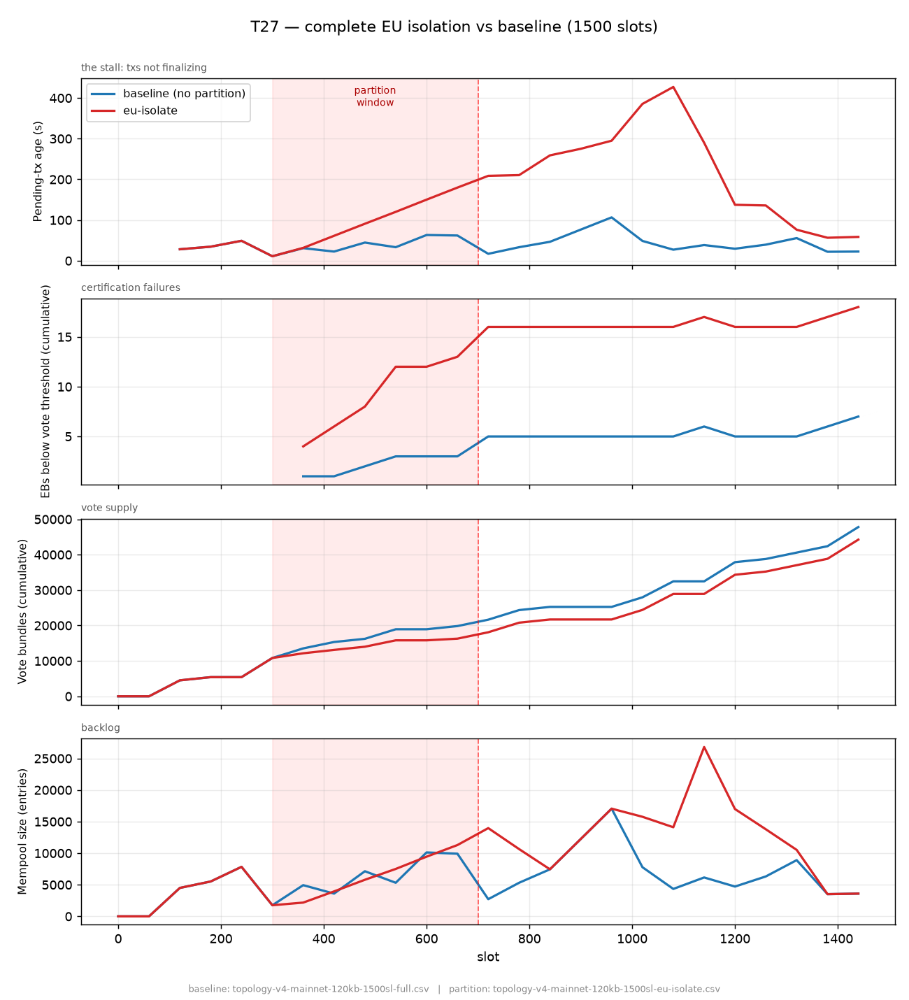

# T27 — Mempool partitioning via network control (Linear Leios, mainnet)

**Threat (per [docs/threat-model.md](https://github.com/input-output-hk/ouroboros-leios/blob/main/docs/threat-model.md)).**
T27 is a transaction-based denial-of-service: an adversary with **network
infrastructure control** segments transaction propagation, giving block
producers **inconsistent mempool views**. Predicted effect — *"conflicting EBs
that don't reach quorum (in time), wasting voting resources"* — i.e. degraded
**throughput** and wasted resources, not a ledger-safety break. Mitigation is
rated **Limited** (the upstream/downstream directional asymmetry), but the doc
notes Linear Leios **prevents conflicting transactions from reaching permanent
storage**, so *"impact is limited to temporary and mostly local resource waste."*

**Finding.** A complete network partition confirms exactly that bound. The
predicted "conflicting EBs / wasted votes" effect is **negligible** in Linear
Leios — divergent voting does **not** rise under the partition (WrongEB votes
1,800 vs the baseline's 5,396; redundant EB references 0.016%). The only real
cost is a **temporary throughput dip**: certification stalls while the cut is
open and the chain fully recovers after it heals, finalizing ~97.6% of txs —
matching the unpartitioned baseline. So T27's impact on Linear Leios is
**transient and local**, as the threat model predicts.



*Chart `ab-120kb-eu-isolate.png`, drawn from two run logs: baseline
`topology-v4-mainnet-120kb-1500sl-full` and partitioned
`topology-v4-mainnet-120kb-1500sl-eu-isolate` (via their `.csv` parses — see
Reproduce). The source files are also stamped along the bottom of the figure.*

## Setup

| | |
|---|---|
| Topology | `topology-v4-mainnet.yaml` (2685 nodes, 30,414 links), seed 0 |
| Params | `mainnet.yaml` (`linear-with-tx-references`, sequential, 6 shards) + `t27-steady.yaml` |
| Load | 120 kB/s (`tx-generation` 12.5 ms ≈ 80 tx/s), continuous to slot 1500 — **below the certification ceiling** |
| Partition | complete EU isolation (`--isolate`, EU 1052 vs 1633 others), **84,746 edges cut** |
| Window | **slots 300–700** (cut → heal) |
| Slots | 1500 |

The cut is a **network-layer** edge drop (a `partition-scenarios` overlay), not
adversarial node behaviour — it drops all traffic across the boundary in both
directions, the faithful reproduction of "network control."

## Result

| metric (final) | baseline (`full`) | EU-isolated |
|---|---|---|
| **txs finalized** | 112,560 / 115,200 (97.7%) | **112,412 / 115,200 (97.6%)** |
| txs referenced by an endorsement | 110,280 | 110,072 |
| **WrongEB votes** (divergent voting) | 5,396 | **1,800** (not elevated) |
| **redundant EB references** (conflicting-EB signal) | 0 (0.000%) | **18 (0.016%)** |
| EBs below vote threshold | 6 / 64 | 17 / 64 |
| pending-tx age, end | 16.5 s | 68.5 s (off a 427 s peak) |
| mempool, end | ~3.6k | ~3.6k (drained, off a ~27k peak) |

The two T27-defining signals — **conflicting EBs** and **wasted votes** — are
**not** worsened by the partition: WrongEB is *lower* than baseline (divergent
voting tracks block-production activity, which the cut reduces), and only 18 txs
(0.016%) end up referenced by more than one endorsed EB. Final throughput is
within 0.1% of baseline. The partition's cost is a **transient**, not a
permanent loss.

## Why conflicting EBs stay negligible

The threat model's own mitigation is the reason: **Linear Leios prevents
conflicting transactions from reaching permanent storage.** During the cut each
side builds EBs from its own mempool, but those EBs only certify once the network
is whole and a stake quorum is reached — so no two conflicting EBs are finalized,
and conflicting txs never reach the ledger. The inconsistency is confined to
*uncertified* EBs that expire harmlessly, exactly the "temporary and mostly
local resource waste" the doc describes.

## Behaviour over time — the throughput dip

`missing_txs` (referenced txs a node still needs to vote) stays at **0**
throughout. Backlog builds during the cut, peaks ~400 slots after the heal, then
drains:

```
            slot   mempool   pending_age   EBs<thr
 cut 299 →   300     1,759       11 s         —
            480     5,790       91 s          8
            600     9,446      150 s         12
heal 700 →  720    13,966      209 s         16
           1080    14,104      427 s ← peak  16
           1140    26,796      290 s ← peak  17
           1320    10,520       76 s         16
           1380     3,518       56 s         17   ← drained
           1440     3,600       69 s         17
```

**During the cut, certification stops.** Endorsements flatline from ~slot 420 to
the heal, and EBs pile up below quorum (`EBs<thr` 4 → 16). Cause: quorum is
**stake-weighted** (`top-stake-fraction`, `quorum-weight-fraction` 0.75; each
voter's weight = its stake) and the threshold is computed from the **whole**
network and fixed — so when the cut removes enough stake that **neither side
holds 75%**, nothing certifies until the network reunites. This is the
"throughput waste" T27 predicts, expressed as a clean stall.

**After the heal, certification resumes** and drains the backlog. The drain rate
is capped by the **certification ceiling** (`rb-generation-probability 0.05`;
"38 of 64 EBs expired before reaching an RB"), so recovery takes ~680 slots —
recovery time ≫ partition duration, but it completes and returns to baseline.

## Why a *complete* partition is required

A `set-to-set` EU↔NA cut barely registers — it leaves ~712 other-region bridge
nodes intact and gossip reroutes around it (≈0.3% vote dip). To exercise T27 you
must sever the group from **everyone** (`--isolate`), producing a true
bipartition (84,746 edges vs the leaky cut's 53,744). See
[eu-na-partition-run.md](eu-na-partition-run.md).

## Load regime — why 120 kB/s, not the default 200 kB/s

The default mainnet load is **200 kB/s**, but at that rate the chain is already
backlogged *before* any partition: the offered load exceeds the **certification
ceiling** — the rate at which EBs can be certified given `rb-generation-probability
0.05` (~1 ranking block per 20 slots). So we use **120 kB/s**, below the ceiling,
putting the baseline in true steady state. Otherwise you can't separate
"partition damage" from "an overloaded chain that can't drain any backlog."

This is **not network saturation**: link delivery is **100%** in every run
(TX/EB/Vote all received). The limit is Leios **certification throughput**, not
network bandwidth.

## Variant note

The result holds for **both** Linear Leios variants — `linear` (tx bodies inline)
and `linear-with-tx-references` (EB references txs by hash). Both stall during
the cut and recover after heal to the same finalization; the
[`leios-variant-linear`](topology-v4-mainnet-120kb-1500sl-leios-variant-linear-eu-isolate)
control matches the references run above.

## Reproduce

```sh
# complete EU isolation, window 300–700
python3 scripts/gen-partition.py \
  ../data/simulation/pseudo-mainnet/topology-v4-mainnet.yaml \
  --from EU --isolate --name eu-isolate --start 300 --stop 700 \
  -o ../threats/t27/eu-isolate.yaml

# baseline (full) and partitioned (eu-isolate) -- these two logs feed the chart
cargo run --release ../data/simulation/pseudo-mainnet/topology-v4-mainnet.yaml -s 1500 \
  -p ./sim-cli/configs/mainnet.yaml -p parameters/t27-steady.yaml \
  2>&1 | tee ../threats/t27/topology-v4-mainnet-120kb-1500sl-full
cargo run --release ../data/simulation/pseudo-mainnet/topology-v4-mainnet.yaml -s 1500 \
  -p ./sim-cli/configs/mainnet.yaml -p parameters/t27-steady.yaml \
  -p ../threats/t27/eu-isolate.yaml \
  2>&1 | tee ../threats/t27/topology-v4-mainnet-120kb-1500sl-eu-isolate

# parse logs -> per-slot CSVs
python3 analyze.py \
  topology-v4-mainnet-120kb-1500sl-full \
  topology-v4-mainnet-120kb-1500sl-eu-isolate

# 4-panel A/B chart (matplotlib: pip install matplotlib)
# the source CSVs are stamped onto the figure footer
python3 plot.py \
  topology-v4-mainnet-120kb-1500sl-full.csv \
  topology-v4-mainnet-120kb-1500sl-eu-isolate.csv \
  --window 300 700 --label eu-isolate \
  --out ab-120kb-eu-isolate.png
```
